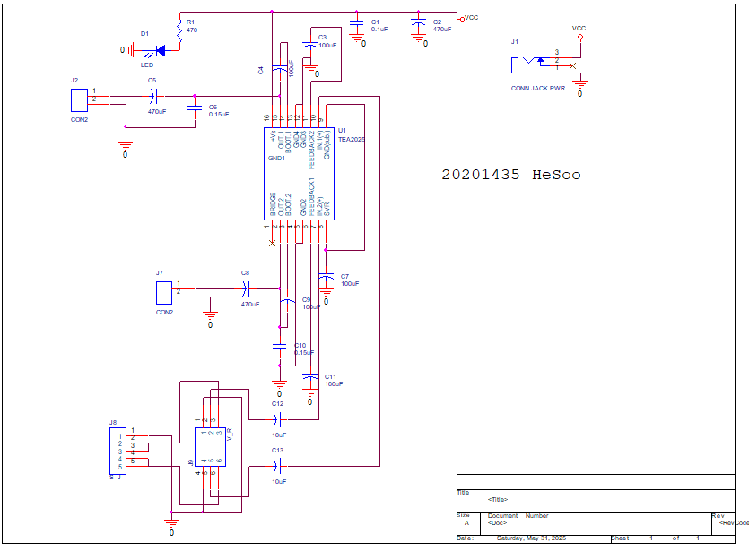
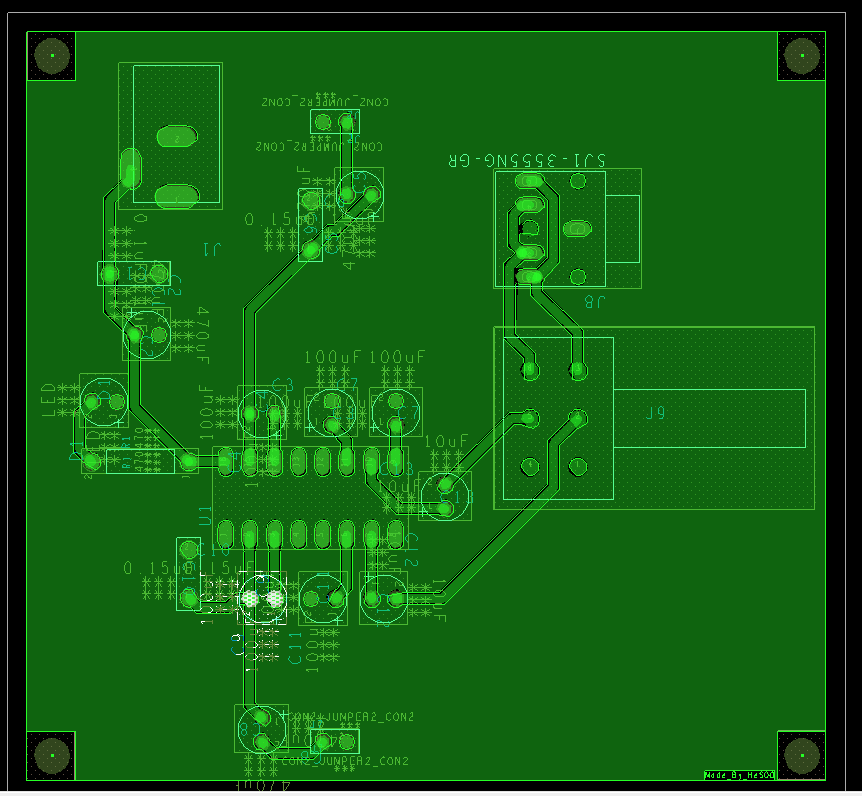
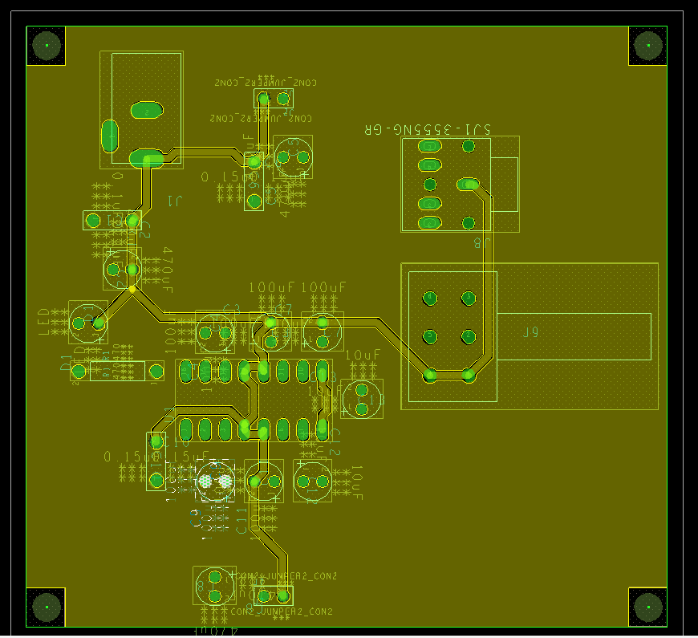

# 🎵 TEA2025 Stereo Amplifier  

## 🔎 Overview
This project implements a **stereo audio amplifier circuit** based on the **TEA2025 IC**.  
It takes low-level audio input signals (e.g., from a smartphone or MP3 player) and amplifies them to drive external speakers.  

---

## 🔧 Hardware Features

| Component                  | Purpose                                                                 |
|----------------------------|-------------------------------------------------------------------------|
| **TEA2025 IC**             | Core dual-channel audio amplifier, supports stereo L/R channels        |
| **Power Supply (J1, C1, C2, LED)** | Provides stable DC input, filtering capacitors, and power indicator |
| **Audio Input (J2, J7, C5, C8)**   | Stereo input connectors with coupling capacitors to block DC offset |
| **Audio Output (J3, C12, C13)**    | Amplified output sent to external speakers via protection capacitors |
| **Feedback Capacitors (C6, C7)**   | Set amplifier gain and frequency response characteristics           |
| **Ripple Rejection (C10, C11)**    | Reduce noise from the power supply for cleaner audio                |
| **Indicator LED (D1, R1)**         | Visual indicator of power-on status                                 |

---

## 📸 Hardware Overview
| PCB preview | PCB Preview |
|-----------|-------------|
|  |  |

---

## ✅ Current Status
- [x] Schematic design completed  
- [x] Component selection & wiring verified  
- [x] PCB layout  
- [x] Hardware testing with speakers  
